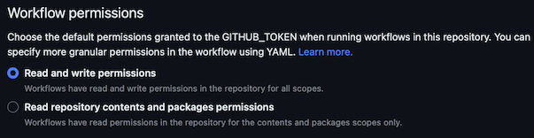
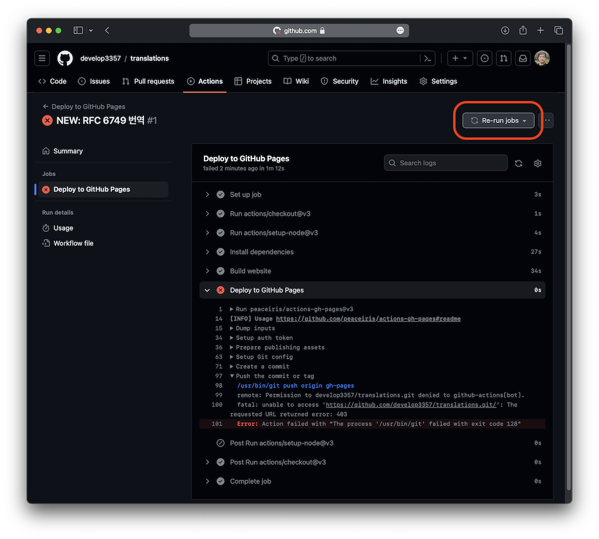
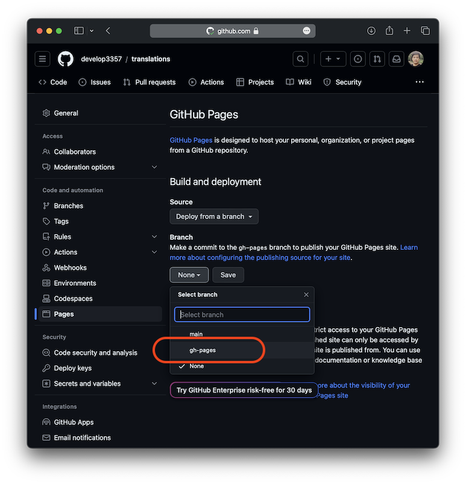
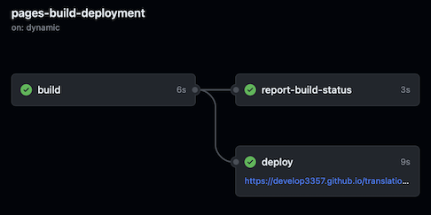

Docusaurus를 사용해 개발한 정적 웹사이트를 Github Pages를 사용해 배포하는 방법을 작성했다.  
아래 문서에서 제공하는 방법을 사용해, Github Actions로 빌드 및 배포를 자동화한다.

https://docusaurus.io/docs/deployment#triggering-deployment-with-github-actions

이 방법은 타사의 배포 액션([peaceiris/actions-gh-pages](https://github.com/peaceiris/actions-gh-pages#%EF%B8%8F-docusaurus))을 사용한다.  
해당 액션은 소스와 배포를 다른 공간에 둔다. 한 레파지토리에서 두 개의 브랜치를 사용해도 되고, 각각 분리된 두 개의 레파지토리를 사용할 수도 있다.

이 문서에서는 한 레포지토리에서 두 브랜치를 사용하는 방법을 택했다. 소스코드는 `main` 브랜치를 사용하고, 빌드된 결과물은 `gh-pages` 브랜치를 사용해서 배포한다.

## 설정 방법 요약

아래 과정으로 진행된다.

1. 먼저 Github Actions의 `workflow` 권한을 읽고 쓰기로 변경한다(기본값은 읽기 권한만).
2. 프로젝트에 `workflow` 파일을 추가하고, 원격 저장소로 푸시한다.
3. 푸시가 완료되면, Github에서 `workflow`가 실행된다. 끝나면 `gh-pages` 브랜치가 생성된다.
4. Pages 설정에서 기준 브랜치를 `gh-pages`로 변경해준다.

## Github Actions를 이용해 Docusaurus를 Github Pages로 배포하기

### Workflow의 권한 변경

`Settings` -> `Actions` -> `General`에서 읽기, 쓰기 권한을 모두 허용하고 설정을 저장해준다.



### Workflow

[peaceiris/actions-gh-pages](https://github.com/peaceiris/actions-gh-pages#%EF%B8%8F-docusaurus)의 방법을 활용한 두 가지 워크 플로우를 사용한다. 하나는 실제 배포는 하지 않고 정상적으로 빌드되는지 확인하기 위한 테스트용 워크플로우인데, 반드시 사용하지 않아도 무방하다. 나머지 하나는 빌드 후 배포하는 워크플로우이다.

**테스트용 워크플로우**

```yaml
# .github/workflows/test-deploy.yml
name: Test deployment

on:
  pull_request:
    branches:
      - main
    # Review gh actions docs if you want to further define triggers, paths, etc
    # https://docs.github.com/en/actions/using-workflows/workflow-syntax-for-github-actions#on

jobs:
  test-deploy:
    name: Test deployment
    runs-on: ubuntu-latest
    steps:
      - uses: actions/checkout@v3
      - uses: actions/setup-node@v3
        with:
          node-version: 18
          cache: npm

      - name: Install dependencies
        run: npm ci
      - name: Test build website
        run: npm run build
```

**배포 워크플로우**

```yaml
# .github/workflows/deploy.yml
name: Deploy to GitHub Pages

on:
  push:
    branches:
      - main
    # Review gh actions docs if you want to further define triggers, paths, etc
    # https://docs.github.com/en/actions/using-workflows/workflow-syntax-for-github-actions#on

jobs:
  deploy:
    name: Deploy to GitHub Pages
    runs-on: ubuntu-latest
    steps:
      - uses: actions/checkout@v3
      - uses: actions/setup-node@v3
        with:
          node-version: 18
          cache: npm

      - name: Install dependencies
        run: npm ci
      - name: Build website
        run: npm run build

      # Popular action to deploy to GitHub Pages:
      # Docs: https://github.com/peaceiris/actions-gh-pages#%EF%B8%8F-docusaurus
      - name: Deploy to GitHub Pages
        uses: peaceiris/actions-gh-pages@v3
        with:
          github_token: ${{ secrets.GITHUB_TOKEN }}
          # Build output to publish to the `gh-pages` branch:
          publish_dir: ./build
          # The following lines assign commit authorship to the official
          # GH-Actions bot for deploys to `gh-pages` branch:
          # https://github.com/actions/checkout/issues/13#issuecomment-724415212
          # The GH actions bot is used by default if you didn't specify the two fields.
          # You can swap them out with your own user credentials.
          user_name: github-actions[bot]
          user_email: 41898282+github-actions[bot]@users.noreply.github.com
```

npm을 사용하는 워크플로우이고, yarn을 사용하는 경우는 아래와 같이 각각 변경해야 한다.

> cache: npm -> cache: yarn  
> npm ci -> yarn install --frozen-lockfile  
> npm run build -> yarn build

소스 코드에서 `.github/workflows` 디렉토리 아래에 워크플로우 파일을 두고, 이것을 Github로 푸시하면 워크플로우가 실행된다.

### 워크플로우가 실패했을 때

저장소에서 `Actions`로 들어가면 실행된 워크플로우와 로그를 확인할 수 있다.



위에서 언급했듯 미리 워크플로우의 권한을 읽기, 쓰기 모두 허용해주지 않았다면 배포가 실패한다. 우측 상단의 `Re-run jobs` 버튼을 눌러 수동으로 워크플로우를 다시 실행할 수 있다.

### 배포 기준 브랜치 변경

기본값으로 `main` 브랜치를 배포하는데, 이 워크플로우는 빌드 결과물을 `gh-pages` 브랜치에 푸시한다. 따라서 `gh-pages` 브랜치를 배포하도록 설정을 변경해야 한다.

`Settings` -> `Pages`에서,

- `Source`가 `Deploy from a branch`인지 확인하고
- 브랜치를 `gh-pages`로 변경하고, 저장한다. (폴더는 `/ (root)` 그대로 두면 된다)



### 배포 결과 확인



배포 기준 브랜치를 `gh-pages`로 변경하면 다시 워크플로우가 실행된다. 완료된 후 정상적으로 배포된 웹 페이지를 확인할 수 있다.

이 문서에서 사용한 워크플로우는 `main` 브랜치를 빌드하고, 빌드 결과(`/build` 내의 폴더 및 파일들)를 `gh-pages` 브랜치로 푸시하고, 이것을 배포하는 단순한 과정이다. 워크플로우 실행 중 오류가 발생했다면 단순 실수일 가능성이 크므로(예를 들어 yarn 사용자가 npm을 사용한 이 문서의 워크플로우를 그대로 사용한 경우) 오류 로그를 확인하고 직접 수정하기 바란다.
