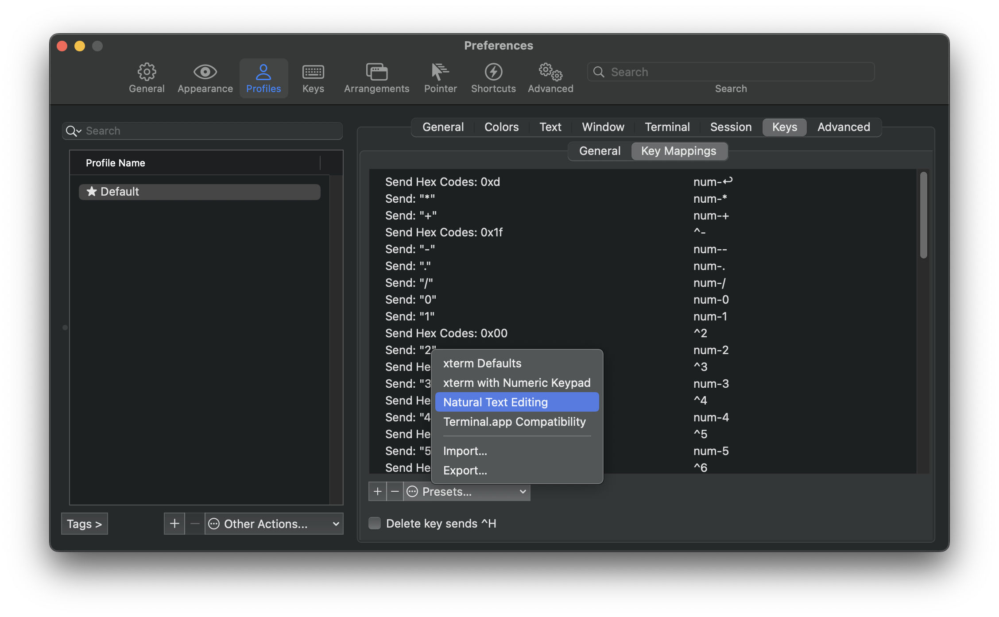

Iterm2에서 아래 동작이 안 된다면 설정을 변경해야 한다.

- ⌥ + ←,→ (Option + Arrow): 단어 단위로 커서 이동
- ⌘ + ←,→ (Command + Arrow): 문장의 처음/끝으로 이동
- ⌘ + ⌫ (Command + Delete): 한 문장 삭제

#### 설정 방법

1. Preference 오픈 (⌘+,)
2. Profiles 탭
3. Keys → Key Mappings
4. 하단의 Presets...에서 Natural Text Editing 선택

