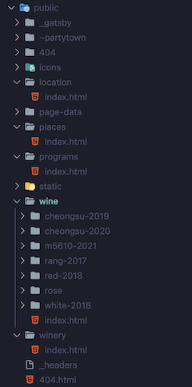
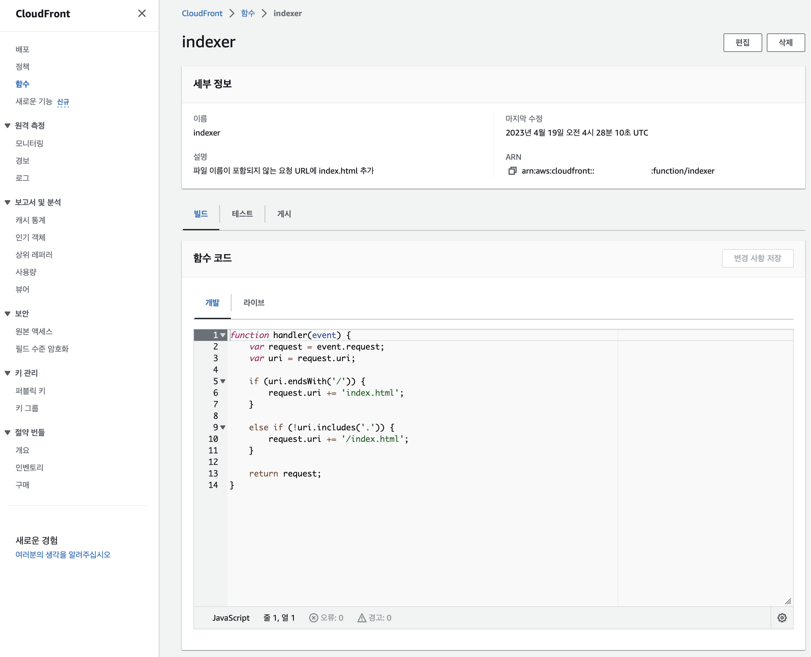
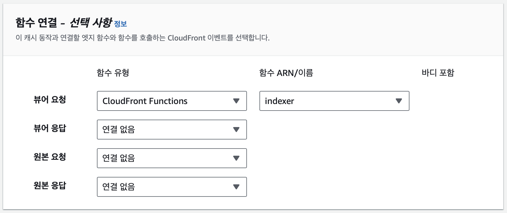

Gatsby로 개발한 정적 웹사이트를 배포하는 방법 중, S3와 Cloudfront를 사용하는 것은 좋은 대안이다.

Cloudfront는 현재 전송량 월 1TB까지 무료이며, 전세계 네트워크를 사용해 사용자로부터 가장 가까운 곳으로부터 컨텐츠를 전송하기 때문에 반응 속도와 전송 속도가 향상된다. 여러 네트워크에 컨텐츠가 저장되기 때문에 가용성과 안전성이 향상된다.

## S3를 사용해 정적 웹사이트 배포

S3만 사용해서도 정적 사이트를 배포할 수 있고 방법은 간단하다.


- S3의 퍼블릭 액세스를 허용해야 한다.
- 인덱스 문서는 일반적으로 index.html로 지정한다.

S3로 업로드는 무료이지만 인터넷으로 내보낼 때는 100GB당 9달러가 나온다. 요청 수에 따라 별도로 추가되는 요금도 있다.

- https://aws.amazon.com/s3/pricing/
- https://aws.amazon.com/cloudfront/pricing/

CloudFront의 프리티어 전송량이 훨씬 크기 때문에 S3만 단독으로 사용해서 배포하는 것보다 CloudFront를 같이 사용하는 것이 좋다. 속도도 더 빠르다.

## S3와 CloudFront를 사용한 정적 웹사이트 배포


- 원본 도메인에서 정적 웹사이트를 업로드해둔 S3로 선택해준다.
- S3는 퍼블릭 액세스를 제한하고, CloudFront로만 하는 것이 바람직하기 때문에 "원본 액세스 제어 설정(권장)"을 선택해준다. 아래 Origin access control에서 제어 설정이 존재하지 않는 경우 기본값으로 하나 생성해주면 된다.
- S3 버킷에서 CloudFront의 접근만 허용해야 한다. 위에 보이는대로 정책 복사해서 그대로 붙여넣어주기만 하면 된다.

S3에서 정적 웹사이트를 배포할 때는 인덱스 문서를 설정할 수 있고 리다이렉션 규칙도 지정할 수 있지만 CloudFront에서는 따로 대처해야 한다.

이 문제를 해결하는 몇몇 방법이 있다.

### CloudFront Functions를 사용한 라우팅

Gatsby로 만든 정적 웹사이트는 웹페이지 경로마다 index.html 파일이 각각 생성된다. 따라서 웹페이지 접근 요청에 대해서 index.html을 붙여주는 처리가 필요하다.



```javascript
function handler(event) {
  var request = event.request;
  var uri = request.uri;

  // Check whether the URI is missing a file name.
  if (uri.endsWith("/")) {
    request.uri += "index.html";
  }
  // Check whether the URI is missing a file extension.
  else if (!uri.includes(".")) {
    request.uri += "/index.html";
  }

  return request;
}
```

필요한 작업은 단순히 요청 URL을 검사한 다음 필요한 경우 index.html을 붙여주는 전처리를 추가하는 것이다. Lambda를 사용할 수도 있지만 CloudFront Functions를 쓰는 것이 비용이나 속도 면에서 유리하다. (람다는 100만 회당 0.6달러, Functions는 200만회까지 무료, 초과시 100만회당 0.1달러)





위 스크린샷 예시처럼 함수를 추가하고 연결해주면 된다.

여기서는 Gatsby로 빌드한 정적 웹사이트를 배포했다. Gatsby가 빌드한 결과는 웹페이지마다 index.html 파일을 각각 생성하는 규칙을 갖고 있기 때문에 위와 같은 방법을 사용했다. Next.js를 사용하는 경우

#### 참고

- https://docs.aws.amazon.com/ko_kr/AmazonCloudFront/latest/DeveloperGuide/Introduction.html
- https://docs.aws.amazon.com/ko_kr/AmazonCloudFront/latest/DeveloperGuide/example-function-add-index.html
