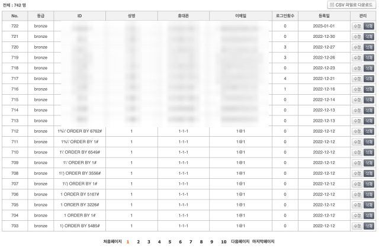
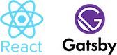
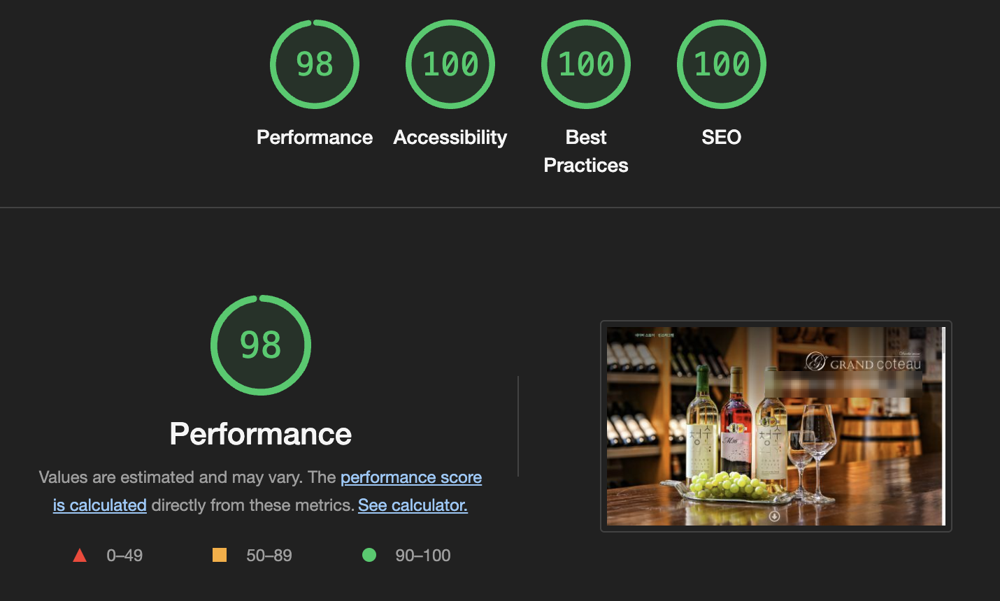

최근 기업용 홈페이지 제작 의뢰를 받아 두 달 정도 작업했다. 개발자로서의 임무(개발, 배포) 이외에도 기획, 디자인까지 전체를 맡아서 수행했다. 그 과정에서 내렸던 의사 결정과 얻은 경험에 관해 서술해본 글이다.

## 개발 이유

기존 홈페이지는 상당한 금액을 주고 의뢰한 쇼핑몰이었다. 그런데 잦은 오류가 발생했고 개발사에서도 문제를 회피하다보니 점점 정상적으로 이용하기가 어려워졌다고 한다. 덕분에 쇼핑몰임에도 불구하고 제 역할을 하지 못하고 카##등 다른 판매 경로에서 대부분의 구매가 일어났다. 결국 유명무실한 쇼핑몰을 없애고 업체 및 제품 소개용 단순 홈페이지로 리뉴얼 하게 된다.

기존 홈페이지의 개발 언어는 PHP인데 아마 한 20년쯤 전에 짜놨던 템플릿을 단순 수정해서 재사용한 걸로 보였다. 기본적인 웹사이트 공격에 대한 대처도 전혀 되어있지 않았다. 회원의 비밀번호를 평문으로 저장했고, 사용자 입력값 검증을 제대로 하지 않아서 회원 정보 테이블에 SQL 명령어로 채워진 필드들이 가득했다. 게시판에는 영문으로 "당신의 웹사이트는 해킹당했으니 이 주소로 비트코인을 보내라"는 글들이 즐비했다.

## 초기 기획안

> 알아서 잘 해주세요!

개발자 입장에서 충분히 자세한 요구사항 명세서가 있다면 정말 좋겠지만, 그렇지 못한 경우가 많은 것 같다. 이번에는 별다른 요구사항 없이 업체 소개, 제품 소개, 사진만 제공 받았다. 결국 기획, 디자인, 개발, 배포만 하면 되는 운명을 맞았다. 다행히 큰 틀은 있었다. 아무 기능이 없는 단순 정적 웹페이지로 제작하되 나머지는 알아서 잘 해주셨으면 좋겠다는 것이다. 처음 미팅 때 **저는 기획자나 마케터는 아니고 말그대로 찐 프로그래머**라고 소개드렸지만, 그냥 홈페이지 만드는 사람으로 인식된 것 같다.

## 기획, 디자인

만약 팀에 속한다면 솔직히 하고 싶지 않은 업무이지만 그래도 할 줄 알아서 나쁠 건 없다. 요구사항 자체가 대충 알아서 해주세요고 건네 받은 정보는 업체 소개, 제품 소개 텍스트, 사진 몇십 장 정도였다. 이걸 가지고 홍보 및 제품 소개용 홈페이지를 만들기 위해서 먼저 각 페이지를 구성하는 것이었다. 그래서 정리한 방법은 아래와 같다.

- 텍스트, 사진을 항목별로 체계화
- 건네 받은 텍스트는 모두 사용하고, 사진은 주제에 맞는 사진을 선별해서 사용

구체화해보니 정보는 조금 부족하고 사진도 딱히 주제로 엮을만한게 많지 않았다. 내용을 더 달라고 요청해봤는데 일이 바쁘셔서 협조적인 피드백은 받기 어려웠다. 아래와 같이 작업했다. 개발자 회고에 적을 만한 내용은 아니어서 간단히 언급만 하고 싶다.

- 업체의 언론 인터뷰와 이전 홈페이지, 그리고 인스타에서 정보를 최대한 수집
- 사진 중에서 잘 나온 것들을 추리고 사진에 맞는 문구를 직접 작성
- 받은 자료, 수집한 자료, 직접 작성한 자료를 종합해서 홈페이지 구성

## 기술 스택 결정: React, Gatsby

홈페이지 기획에 디자인까지 직접 하느라 작업량이 늘었지만 개발 자체는 간단한 편이었다.

단순 정적 홈페이지이므로 워드프레스 같은 퍼블리싱 툴도 좋은 선택일 수 있겠지만, 작업자 본인이 개발자이기 때문에 옵션에서 제외했다. 다음은 HTML을 직접 짜느냐 아니면 React 기반 프레임워크를 사용할 것이냐를 고민했다.

먼저 평범한 작은 회사들의 홈페이지를 많이 방문해봤다. React를 사용한 곳은 발견하지 못했다. 보통 그런 홈페이지를 제작하는 업체에서는 정형화된 디자인이나 틀 같은게 있고, 그렇게 찍어내는 내부적인 시스템이 있을 걸로 보였다.

홈페이지 기획안이 딱 정해져 있고 페이지 수가 작다면 HTML로 직접 짰을 수도 있다. 이 경우 SCSS 같은 전처리 사용해서 품을 좀 덜었을 거고 자바스크립트는 AOS(Animate On Scroll)을 지원하는 라이브러리를 하나 골라서 사용했을 것 같다. (보니까 거의 모든 홈페이지에 AOS가 들어가서.. 이건 있어야 예쁘다는 공감대가 공급자/소비자 사이에 모두 형성된 것 같다.)

기획, 디자인 중 아무것도 결정된 게 없고 추후 여러번 바뀔 가능성이 농후하기 때문에 생산성을 중요시해서 React로 결정했다. 단, 홍보용 홈페이지이기 때문에 SEO(검색 엔진 최적화)가 중요하고, 그래서 SSR(서버 사이드 렌더링)이나 SSG(정적 사이트 생성기)를 지원하는 프레임워크를 필수적으로 사용해야 한다. 그래서 후보로 Gatsby, Next.js가 올랐다.

Next.js는 SSR, SSG 모두 가능하고 몇몇 이유로 좀 더 끌렸지만, SSG의 경우 Gatsby 쪽이 성능이 약간 더 빠르다고 해서 그냥 이걸로 결정했다. 둘 다 써본 적이 없고, Next.js는 언젠가는 쓰게 될 것 같은데 Gatsby는 웬만하면 써볼 일 없을 것 같아서 골고루 경험해보자는 생각이 컸다. 어차피 둘 다 이번에 처음 사용해보는 거라 가볍게 생각하고 결정했다.

차후에 제품 정보 수정이 일어날 것을 예상해서 제품 정보는 따로 객체로 만들어서 관리하고 빌드 타임에 채워넣도록 했다. CMS(컨텐츠 관리 시스템) 툴로 Contentful을 도입해서 사용해봤으나, 상용으로 쓰려면 라이센스 비용을 지불해야 하기 때문에 개발 단계에서 잠깐 사용해보고 제거했다.

## 배포 환경 선택: AWS S3, CloudFront

서버 호스팅 비용은 업체에게 아무 것도 아닌 금액이지만 그래도 최대한 줄여보고자 했다. 테스트 단계에서는 Netlify 사용했다. 배포가 정말 편리했지만 속도가 아쉬웠기 때문에 운영 서버는 AWS로 정했다. 정적 웹사이트이기 때문에 EC2나 Lightsail까지 사용할 필요는 없이 S3만 사용해서도 배포가 가능했다. 추가로 S3에 CloudFront를 연결해 CDN으로 사용하도록 해서 속도도 더 높이고 비용도 절약했다. (CloudFront는 현재 월 전송량 1TB까지 무료)

빌드한 정적 웹사이트는 S3로 업로드하고, S3는 퍼블릭 액세스를 제한하고 연결된 CloudFront만 접근 가능하도록 했다. Route53 사용해서 SSL 발급해서 적용, 그리고 웹사이트 도메인을 해당 CloudFront로 연결했다.

추가로 간단한 설정을 하나 더 추가했다. S3에서 정적 웹호스팅을 할 때는 접근 경로에 따라 index.html을 붙여주는 기능이 있지만 CloudFront에는 따로 없기 때문에 CloudFront Functions를 사용해 처리했다.

## 요구사항 중도 변경

단순 페이지 추가 정도를 예상했는데 아예 기능 추가 요구가 생겼다. 기존에는 정적 웹사이트로 만들기로 했는데, 관리자가 제품 정보 등을 수정하는 기능을 넣어달라고 했다.

바람직하지 않지만 흔히 일어나는 일이다. 했던 작업을 모두 갈아엎는 것에 대해서는 별로 의미 두지 않는다. 대신, 늘어나는 개발 기간에 맞는 보수가 추가로 주어지면 된다고 생각한다.

변경해야할 점을 정리해봤다.

1. 이제 정적 웹사이트가 아니게 됐다. 변경되는 정보는 동적으로 반영되어야 하고, 서버 연산이 필요하게 돼서 S3, CloudFront가 아닌 다른 서비스로 변경해야만 한다. 정보를 입출력할 방법/장소도 추가해야만 한다.
2. 기존 Gatsby 프로젝트에서도 데이터를 클라이언트 단에서 불러오도록 하면 간단하다. 그런데 이번에는 SEO를 중요시해서 반드시 SSR로 하고자 했다. Gatsby에서 SSR을 하려고 애쓰는 것보다는 그냥 프로젝트를 Next.js로 포팅하는 게 훨씬 빠르고 간단하다고 판단했다.
3. 관리자 페이지를 새로 만든다. 간단한 관리자 인증을 구현하고, 데이터를 변경하는 기능과 웹페이지를 추가한다.
4. 정보를 변경할 수 있는 페이지마다 저장소에서 불러온 데이터를 반영하도록 변경한다.

### 1. Gatsby → Next.js

프로젝트를 Next.js로 포팅하는 것은 간단했다. GatsbyImage와 NextImage가 이미지를 다루는 방식이 달라서 그 부분은 모두 수정해야 했다. 이외에는 라우팅만 조금 수정하고 다른 부분은 거의 변경없이 해결됐다.

개인적으로 Next.js쪽이 편하다고 느낀점이 몇몇 있었다. Gatsby에서는 정적 이미지를 불러올 때 prop을 동적으로 전달할 수 없고 graphql을 반드시 거쳐야만 했다. 대신 Next.js는 이미지에 반드시 사이즈를 설정해줘야 하지만, 이건 Layout Shift를 방지하기 위함이라는 명확한 이유가 있기 때문에 합리적이라고 생각한다.

### 2. DynamoDB

데이터는 제품 정보, 수상 내역, 체험 프로그램 등이었다. 서로 연관성이 없고 단순 입출력만 되면 충분했으며 규모도 매우 작아서 RDBMS를 사용할 필요는 없다. DynamoDB는 요금을 온디맨드 방식으로 설정할 수 있다. 비용을 대략 예상해보니 거의 0원에 가까워서 이쪽으로 결정했다.

웹페이지쪽 수정은 간단햇는데, Next.js에서 정적 웹페이지에서 변경이 일어날 때 해당 페이지만 새로 빌드하도록 할 수 있다(getStaticProps 함수에서 revalidate 설정). 주기를 30초로 설정하고 데이터는 DynamoDB에서 읽어오도록 했다.

### 3. 관리자 페이지 개발

필요한 기능은 관리자 인증, 데이터 CRUD, 그리고 파일 업로드이다. 추가로 간단한 입력값 검증을 넣었다. 리액트 생태계는 방대하고 좋은 라이브러리들이 많아서 개발이 수월했다. 간략하게 적어본다.

- iron-session: 관리자 페이지 접근 인증
- bcrypt: 관리자 비밀번호 암호화 및 검증
- ajv: json 스키마 검증 라이브러리인데, 데이터 모델을 이 라이브러리 사용해서 정형화 함.
- react-hook-form: 입력값 검증을 위해 사용한 UI 라이브러리
- @hookform/resolvers: ajv로 정의된 형식을 react-hook-form에서 사용할 수 있도록 해주는 애드온
- react-date-picker: 날짜/시간 선택
- formidable: 파일 업로드 처리

### 4. Lightsail

Lightsail은 EC2에 비해 동사양대비 저렴했다. 복잡한 운영 환경을 구성하는 것이 아니기 때문에 별달리 EC2를 사용할 필요도 없었다. 인스턴스 생성하고 고정IP를 하나 연결해줬다.

서버에 터미널로 접속해서 Nginx, node.js를 설치했다. 앞단에 Nginx를 놓고 node.js 프로세스로 proxy pass 했다. Nginx는 성능도 좋고 SSL 적용도 쉽고, 서버 하나에 여러 인스턴스 돌리기도 편리해서 잘 사용하고 있다. SSL인증서는 Let's Encrypt에서 발급받고 자동으로 갱신되도록 했다.

소스코드 빌드를 서버에서 직접 했다. github private 저장소를 사용했으므로 7일짜리 액세스 키를 하나 발급받아서 복제해왔다. 빌드 완료된 프로젝트는 pm2 사용해서 실행했다. 리눅스에서 부팅 시 자동으로 실행되도록 설정해줬다.

이미지 파일은 종전대로 S3에 업로드하고, 연결된 CloudFront에서 불러와서 사용하도록 했다.

### 기타 완성도를 위한 기준

고객 입장에서는 원래 눈에 보이는 디자인 이외에는 알기 힘든 부분이 많다. 잘 모르고 신경쓰지도 않는 부분이어서 중요하지 않다고 다 무시해버릴 수도 있지만 개발자로서 당연하다고 생각하는 부분은 모두 신경써서 구현했다.

- **반응형 디자인**: 개발할 때 웬만한 사이즈를 모두 확인해가며 디자인하고, 개발했다. 반응형은 디자인 자체가 아니라 방법론에 가깝다고 생각한다. 특정 가로폭에 맞추는 게 아니라 사이즈는 어떻게든 변할 수 있으므로 가로폭에 의존하지 않는 것이다. 반응형 디자인을 하고, 웬만한 사이즈를 모두 확인해가며 개발했다(360px, 414px, 480px, 640px, 768px, 800px, 1024px, 1280px, 1366px, 1920px, 2560px).
- **검색 엔진 최적화**: 메타 태그, Open Graph 태그들을 페이지별로 알맞게 설정해줬다.
- **로딩 속도**: 이미지 사이즈를 최적화하고 CloudFront 같은 CDN을 이용하도록 해서 페이지 로딩 속도를 최대한 높이려고 했다. 페이지 로딩 속도와 매출 사이에 상관관계가 있다는 통계도 있는만큼 중요한 문제라고 생각한다. Next.js가 지원하는 기능을 최대한 활용해, 동적인 페이지를 서버사이드렌더링 하지 않고 정적 페이지를 생성해두고 주기적으로 갱신하는 방법을 사용했다.
- **Lighthouse 벤치마크**를 활용했다. 퍼포먼스 항목은 일반적인 환경에서 대략 95점 이상은 나오는 편이고 나머지 항목은 모든 페이지에서 100점이다.

## 결과, 소감

개발은 수월했지만 기획, 디자인, 의사소통에 품이 더 많이 들어간 프로젝트였다. 나쁘지 않은 경험이었다고 생각한다. 공개적으로 밝히기 어려운 몇몇 교훈을 얻었다.

상용 프로젝트에서 React와 관련 프레임워크를 처음으로 사용해본 좋은 경험이었다. 전 회사에서 JSP로 개발하던 것에 비해서 생산성이 월등히 좋았다. 차후에 프론트 작업을 할 때 기회가 된다면 vue도 써보고 싶다. 점유율 때문에 리액트를 먼저 배웠는데 개인적인 끌림은 vue 쪽으로 향하고 있다.

1인 프로젝트로 간단한 개발을 하는 것도 좋았지만 다음 번에는 복잡한 프로젝트를 맡으면 좋겠다. 그리고 가능하면 팀에 소속돼서 업무가 개발 자체에 더 집중되면 좋겠다. 개발만 100% 하면 좋겠지만 그게 어렵다면 현실적으로 개발 업무 비중이 70%는 넘었으면 한다.
