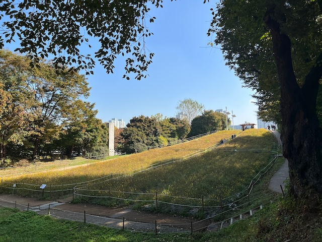
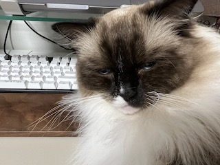

왜 2회냐면, 두 번째이기 때문이다. 첫번째 개발의 날은 지난 달에 했기 때문에..

지난 달부터 한 달에 하루씩 지정해서 `개발의 날`로 삼기로 했다. 개발의 날은 하루의 모든 일정을 내 마음대로 결정하면서, 아침부터 잠들기 전까지 원하는 만큼 개발에 몰두할 수 있도록 모든 우주의 도움-`예비 와이프, 고양이들의 도움`-을 정당하게 요구할 수 있는 날이다.

## 사실 주말에는 와이프와 고양이들과 놀아야 한다

와이프와 사이가 아주 좋기 때문에 평일에 같이 놀지 못한 아쉬움을 주말마다 충당하고 있다. 이번 토요일도 올림픽공원에 다녀왔다. 근처 돈가스 맛집에서 점심을 먹고, 산책만 서너시간을 하고 돌아왔다.

요즘엔 평일은 오전에 헬스장 다니고, 출근해서 일하고, 퇴근해서 쉬다가 일찍 잠드는 삶을 보낸 다음 주말은 와이프와 놀러다니는 풍부한 일정을 소화하고 있다. 그러자니 자기계발에 드는 시간이 부족하지 않나 하는 생각이 들었다. 매주 개발의 날을 추진하자니 범우주적 반발-`와이프와 고양이들의 반발`-이 예상되고, 그러면 한 달에 하루 정도로 타협하니 모든 우주가 만족했다. 지난 달부터 시작해서 오늘은 두 번째 개발의 날이다.

## 개발의 날을 지정한 이유

특별히 개발의 날을 지정한 이유는 평범히 집에서 보내는 일상에서는 집중해서 공부하기가 어려웠기 때문이다.

- 와이프와 놀아줘야 함
- 고양이들도 욕구를 충족시켜줘야 함 (만져주기, 빗질해주기, 놀아주기)

특히 둘째 고양이는 나를 너무나 사랑해서 책상에만 앉아있어도 총체적인 방해를 펼친다.

1. 키보드나 마우스 위에 엎드리기
2. 화면(모니터, 태블릿) 가리기
3. 책상 위에 올라와서 얼쩡거리기...

귀엽고 정신 건강에 매우 도움이 되며 삶의 질이 향상되지만 아무래도 집중이 필요한 공부에는 큰 방해가 된다.

그래서 특별히 개발의 날을 지정하게 된 것이다.

## 개발의 날의 목표

모든 계획은 `지속적`이고 `장기적`으로 유지할 수 있는지가 중요한 문제라고 생각한다.

개발의 날 추진은 아직 초기이다. 아직은 장기적으로 지속할 수 있도록 하기 위한 구체적이고 명시적인 목표를 정하지 않았다. 이런 생활이 익숙해져가면서 점점 더 유용하고 타이트한 계획을 잡아나가려고 생각하고 있다. 단기적으로 개발의 날 목표는 그렇게 어렵지 않은 목표를 세웠다.

> 평소에 메모해두고 넘어갔던 내용들 공부하기

> 앞으로 만들어 갈 커리어 목표를 달성하기 위해 필요한 내용들 공부하기.  
> 단, 실행 계획 자체는 너무 고민하지 말고, 일단 수행하는 것 자체를 중요시하기.

그래서 지금은 탑을 세우는 단계는 아니고 지반을 다지는 느낌으로 진행하고 있다. 대신 너무 널널해서 의미없는 시간이 되지는 않도록 조금 신경은 쓰고 있다.

`토비의 스프링` 책을 시간 날 때마다 읽고 있으며, 개발의 날에도 조금씩 더 읽으려고 한다. 그리고 회사에 구입 신청했던 `이펙티브 자바` 책을 지급 받았는데 이 책도 조만간 읽고 산출물을 만들어 내는 것이 목표이다.

## 요즘 생활

꽤 부지런하게 살고 있다. 새벽에 헬스장 다니기 시작한 지는 4주 정도 지났다. 월~금 빠지지 않고 평일에는 매일 나갔다. 다음주에는 2개월차 인바디를 측정할 예정인데 얼마나 바꼈을지 궁금해진다. 평일 루틴은 아래처럼 정리할 수 있다.

- 06:00 - 기상, 세수/양치만 하고 와이프와 근처 헬스장 출근
- 06:30 - 환복, 기본적인 체조와 스트레칭 후 근력 운동 시작
- 07:40 - 운동을 마치고 샤워, 집으로 이동
- 08:00 - 집에서 간단한 식사, 영양제 챙겨먹고 출근 준비
- 08:27 - 도보로 출근
- 08:57 - 회사 도착
- 18:00 - 퇴근 (도보로 이동)
- 18:30 - 집 도착, 저녁 식사 및 휴식 (와이프와 놀기, 고양이 만지기)
- 22:00 - 잠자기

역삼역에서 학동역까지 도보로 이동하면 생각보다 운동이 된다. 평지가 거의 없고 오르막과 내리막만 있다. 큰 언덕을 두 번 지나면 회사에 도착한다. 경사도 좀 있어서 빨리 걸으면 몸에 땀이 날 정도이다. 덕분에 헬스장에서는 근력 운동만 하고, 유산소는 출퇴근 도보로 대체하고 있다.

영양제도 잘 챙겨먹고 해서 그런지 회사에서도 전혀 피곤하지 않게 18시까지 근무할 수 있다. 대신 퇴근 후 저녁 먹고 집에서 이것저것 하다보면 어느새 잠 잘 시간이 돼서, 평일에 뭔가 `개발적으로 의미있는` 시간을 가지기는 어렵다.

## 평일 목표

주말에 와이프와 시간을 보내는 것도 삶에서 중요한 부분이다. 사람이 오래 일하려면 단기적으로 힘들게 느끼지 않더라도 주말에는 쉬는 시간을 보내는 게 필요하다고 생각한다. 이런 관점에서 요즘 주말 생활은 만족한다. 주말은 잘 쉬고, 한 달에 하루만 개발의 날을 가지는 계획 말이다.

그런데 그러자니 절대적인 자기계발 시간이 너무 짧다. 한 달에 하루 뿐이기 때문이다. 좀 더 시간을 확보할 필요를 느낀다. 요즘은 책을 많이 읽으려고 하는데 진도가 너무 더디다.

평일에 30분 정도만 독서 시간을 확보하고 싶다. 출근 전에는 헬스장, 도보 출근으로 비는 시간이 없다. 그래서 퇴근 후에 시간을 조금 쪼개야 한다.

이건 앞으로 만들어나가야 할 과제이다. 30분이라도 카페에 가기에는 와이프도 섭섭해하고, 그렇다고 집에 있자니 고양이들의 애정공세(방해)가 만만찮다. 퇴근하면 저녁 먹고나서 와이프와 고양이들의 욕구를 먼저 충족해주고나서, 나를 놔주면 그 때부터 스스로 잘 집중해서 책을 읽으면 어떨까.. 하고 생각해본다.

## 마무리

어쨌든 이 모든 일들이 한 사람의 프로페셔널로서 책임감 있게 역할을 다하기 위한 것이다.

회사 업무도 잘 해나가고 있다. 처음에는 업무적 배경 설명 없이 작업만 딱 내려받아서 스스로 파악하고 진행해야 하던 경우가 있었는데 이제는 점점 내용도 공유 받고 있다. 책임이 주어지려면 그에 맞게 정보도 충분히 공유되었으면 하고 바란다. 원하는대로 변하고 있다고 생각한다.

입사한 지 이제 두 달이 지났고, 다음 달 중순에는 평가가 있을 예정이다. 입사 초기에 "일이 주어졌을 때 그 일을 왜 시켰는지를 생각해보라"는 말씀을 들었다. 평소 업무를 하면서 많은 생각을 했고, 의사 결정에 관해서도 여러 대안을 정리한 다음 명확한 이유를 가지고 선택했다. 그런 과정들을 업무 관리 툴(JIRA)에 모두 기록했다. 덕분에 평가를 받기 위해 특별히 더 준비가 필요할 것 같지는 않고 지난 몇 달간 수행했던 업무들을 회고하면서 작업별로 하나씩 되새겨보면 될 것 같다.

단기적으로 평일 독서 시간을 잘 확보해서, 앞으로 한 달의 생활도 잘 해나가고자 한다.
